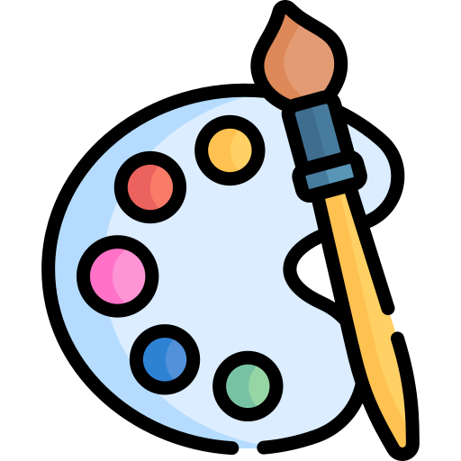
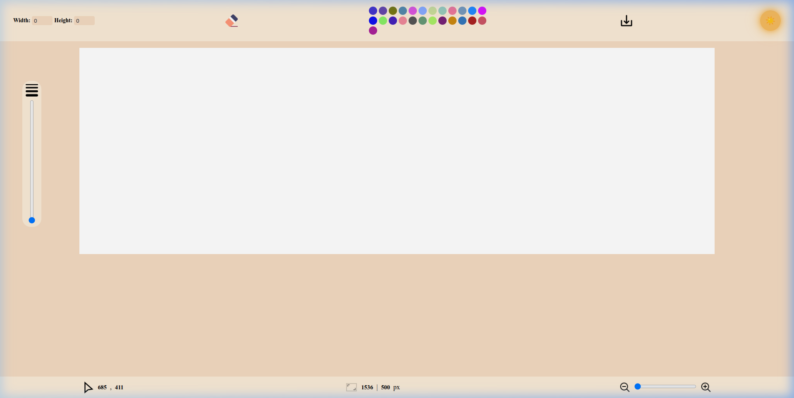
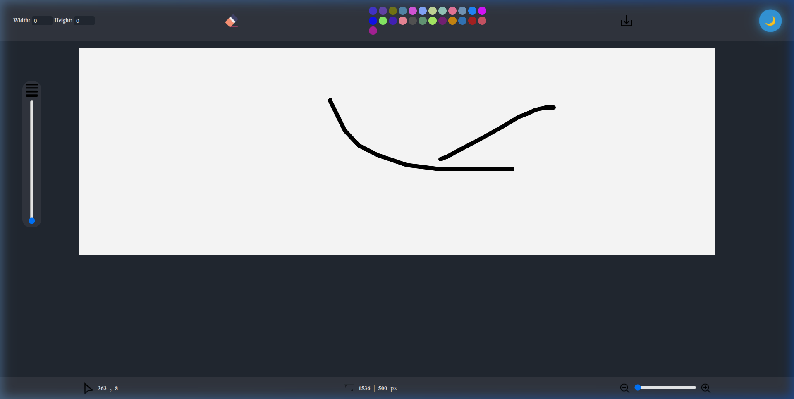
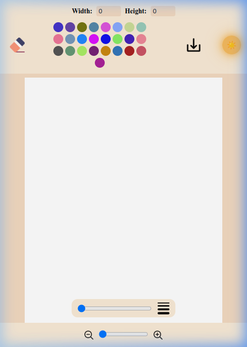
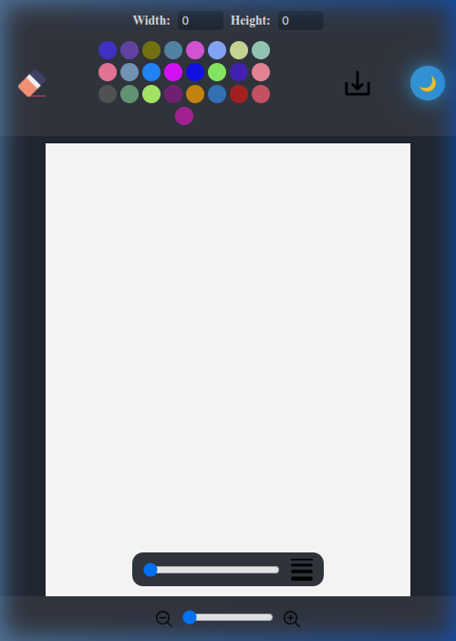
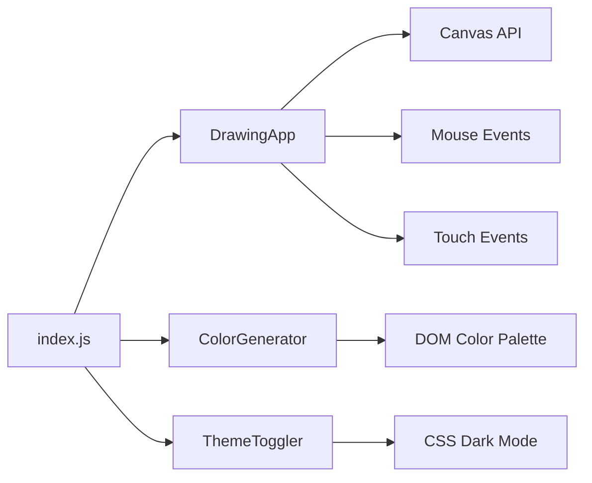

<div align="center">



# 🎨 Paint — Web Drawing Application

A powerful, responsive canvas-based drawing application built with pure **HTML**, **CSS**, and **JavaScript**.  
Create artwork, customize your canvas, and download your creations — all from your browser.

[](https://developer.mozilla.org/en-US/docs/Web/HTML)
[](https://developer.mozilla.org/en-US/docs/Web/CSS)
[](https://developer.mozilla.org/en-US/docs/Web/JavaScript)
[](https://opensource.org/licenses/MIT)

[Live Demo](https://yusefellban.github.io/Drawing-App/) · [Report Bug](https://github.com/yusefellban/Drawing-App/issues) · [Request Feature](https://github.com/yusefellban/Drawing-App/issues)

</div>

---

## 📸 Screenshots

### Desktop — Light Mode


### Desktop — Dark Mode


### Mobile — Responsive View
<p align="center">
  
  &nbsp;&nbsp;&nbsp;
  
</p>

---

## ✨ Features

| Feature | Description |
|---------|-------------|
| 🖌️ **Freehand Drawing** | Draw freely on the canvas with smooth, round-capped strokes |
| 🎨 **Random Color Palette** | 25 randomly generated colors to choose from — every refresh gives you new colors |
| 🧹 **Eraser Tool** | Toggle eraser mode to cleanly remove parts of your drawing |
| 📐 **Custom Canvas Size** | Set custom width & height for your canvas |
| 🔍 **Zoom In / Out** | Smoothly zoom into your artwork with a slider control |
| 📏 **Brush Size Control** | Adjust brush/eraser thickness with a dedicated slider |
| 💾 **Download as PNG** | Save your artwork as a high-quality PNG image with one click |
| 🌙 **Dark / Light Mode** | Toggle between light and dark themes with a sleek sun/moon switch |
| 📱 **Fully Responsive** | Works beautifully on desktop, tablet, and mobile devices |
| 🖱️ **Live Coordinates** | Real-time mouse position tracking displayed in the footer |
| 📊 **Canvas Info** | Live display of current canvas dimensions in pixels |

---

## 🚀 Live Demo

👉 **[Try it now → yusefellban.github.io/Drawing-App](https://yusefellban.github.io/Drawing-App/)**

---

## 🛠️ Getting Started

### Prerequisites

No build tools or dependencies required — just a modern web browser!

### Installation

1. **Clone the repository**
   ```bash
   git clone https://github.com/yusefellban/Drawing-App.git
   ```

2. **Navigate to the project**
   ```bash
   cd Drawing-App
   ```

3. **Open in your browser**
   ```bash
   # Option 1: Simply open index.html directly
   open index.html

   # Option 2: Use a local server (recommended for ES modules)
   python3 -m http.server 8080
   # Then visit http://localhost:8080
   ```

---

## 📁 Project Structure

```
Drawing-App/
├── index.html              # Main HTML entry point
├── index.js                # App initialization & module imports
├── styles/
│   ├── globals.css         # CSS reset & custom properties
│   ├── style.css           # Canvas, controls & responsive layout
│   ├── header.css          # Toolbar / header styles
│   ├── footer.css          # Status bar / footer styles
│   └── change-mode.css     # Dark mode theme & sun/moon toggle
├── utils/
│   ├── DrawingApp.js       # Core drawing engine (canvas, touch, events)
│   ├── add-colors.js       # Random color palette generator
│   ├── change-mode.js      # Theme toggler (light/dark)
│   └── footer.js           # Footer utility (placeholder)
├── assets/
│   └── imgs/
│       ├── logo.png        # App icon / favicon
│       ├── Paint.png       # Social media preview image
│       ├── eraser.png      # Eraser icon (inactive)
│       ├── eraser2.png     # Eraser icon (active)
│       ├── save.png        # Download button icon
│       ├── font-size.png   # Brush size icon
│       ├── mouse.png       # Cursor tracking icon
│       ├── box.png         # Canvas dimensions icon
│       ├── zoom-in.png     # Zoom in icon
│       ├── zoom-out.png    # Zoom out icon
│       └── screenshots/    # README screenshots
└── README.md
```

---

## 🏗️ Architecture

The application follows a **modular OOP design** with ES6 classes and modules:



| Class | Responsibility |
|-------|---------------|
| `DrawingApp` | Core drawing engine — handles canvas setup, mouse/touch input, eraser, zoom, brush size, and image download |
| `ColorGenerator` | Dynamically generates a palette of 25 random hex colors and injects them into the DOM |
| `ThemeToggler` | Toggles the `dark-mode` class on the body for theme switching |

---

## 📱 Responsive Design

The app is fully responsive with three breakpoints:

| Breakpoint | Target | Behavior |
|------------|--------|----------|
| `> 768px` | 🖥️ Desktop | Full toolbar in a single row, side brush slider, full footer info |
| `540px – 768px` | 📱 Tablet | Centered wrapped toolbar, slightly reduced controls |
| `< 540px` | 📱 Phone | Stacked toolbar, horizontal brush slider, zoom-only footer |

**Mobile-specific optimizations:**
- Touch drawing with accurate coordinate mapping via `getBoundingClientRect()`
- `touch-action: none` on canvas to prevent scroll interference
- `{ passive: false }` on touch listeners for proper `preventDefault()`
- Brush size slider repositioned horizontally at the bottom of the screen

---

## 🤝 Contributing

Contributions are welcome! Here's how you can help:

1. **Fork** the repository
2. **Create** your feature branch (`git checkout -b feature/amazing-feature`)
3. **Commit** your changes (`git commit -m 'Add amazing feature'`)
4. **Push** to the branch (`git push origin feature/amazing-feature`)
5. **Open** a Pull Request

---

## 📄 License

This project is licensed under the **MIT License** — see the [LICENSE](LICENSE) file for details.

---

## 👤 Author

**Yousef Ellban**

- GitHub: [@yusefellban](https://github.com/yusefellban)

---

<div align="center">

⭐ **If you found this project useful, please give it a star!** ⭐

</div>
